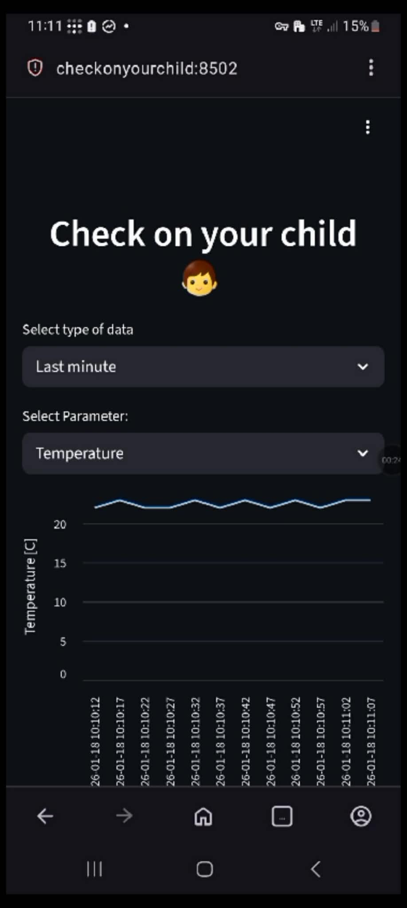
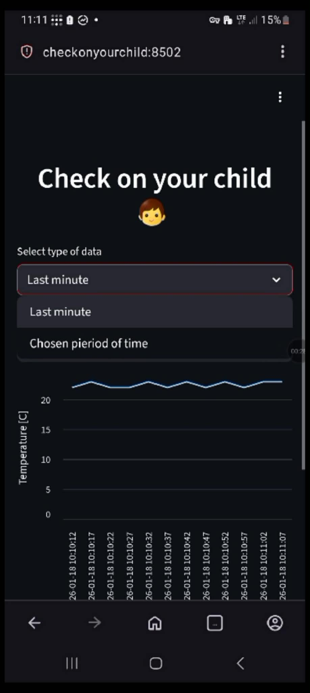
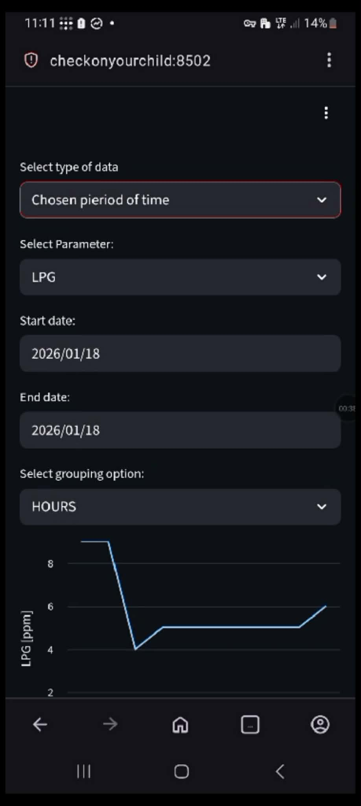
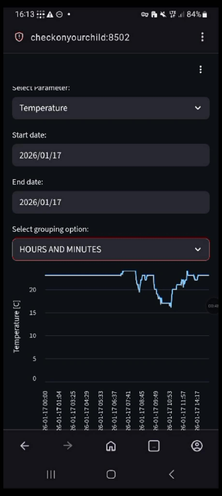
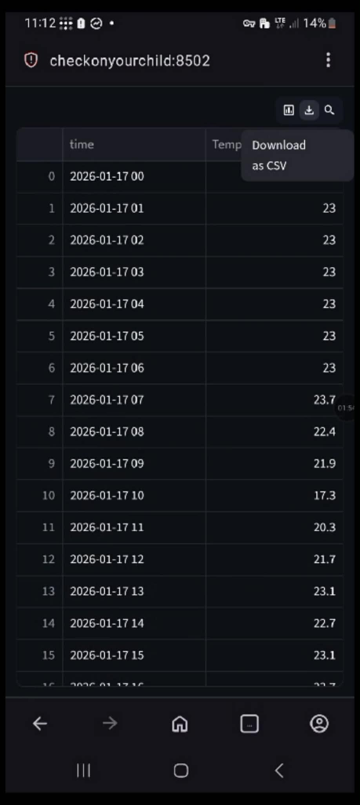

# Environmental monitoring system (for a child’s room)
## 📝Brief description
The system consists of a Raspberry Pi 5 microcomputer (8 GB RAM) and an Arduino UNO R3 microcontroller, connected via UART. It also uses four sensors: Iduino SE019 (sound), MQ-9 (CO), MQ-2 (LPG), and DHT11 (temperature and humidity).
  The sensors are connected to the microcontroller. Every 5 seconds, the data are collected and sent to the microcomputer (**data format: CO|LPG|IsTooLoud|humidity|temperature**). 
  The Raspberry Pi then receives the data, stores them in a database, processes them, and displays them on a website.

## ⚙️Sensor preparation and communication
**MQ sensors must be preheated before use** (details are in datasheets from producers). To measure CO and LPG concentrations, the raw analog outputs from the sensors must be converted into meaningful values.
  The DHT11 uses a one-wire protocol to transmit data. To read its values, functions from the appropriate DHT library can be used.

## 🌐Displaying data
The website was built with the Streamlit library and runs directly on the Raspberry Pi 5. Tailscale VPN is used to access the website from other networks.

## 📸 Example app screenshots
<table>
  <tr>
    <td></td>
    <td></td>
    <td></td>
    <td></td>
    <td></td>
  </tr>
</table>

## 🚀Future of the project
- Create a version for STM32.
- Add a camera to monitor the child and stream the video on the website.
- Train an AI model and add a microphone to detect when a child is crying.
